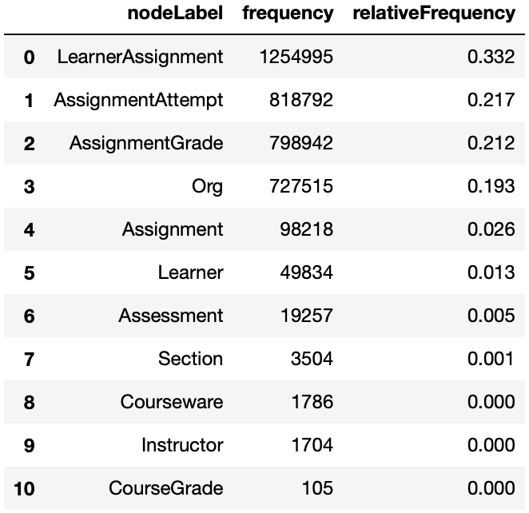
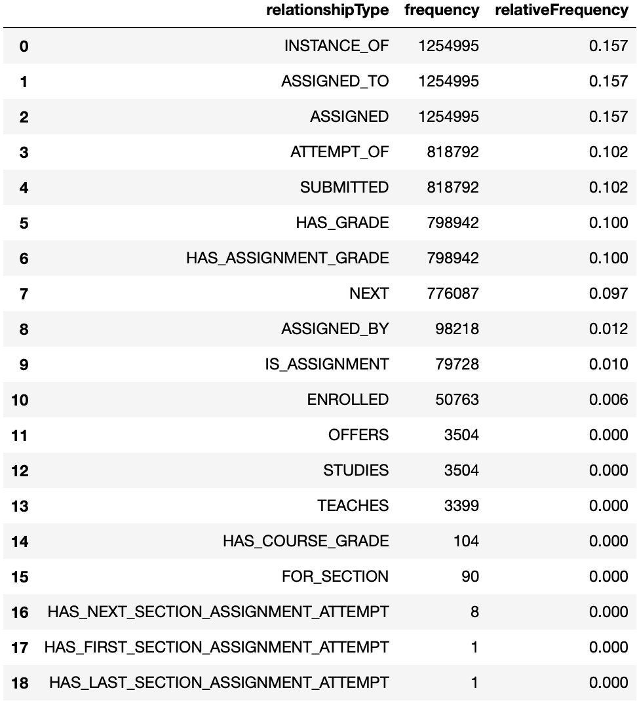
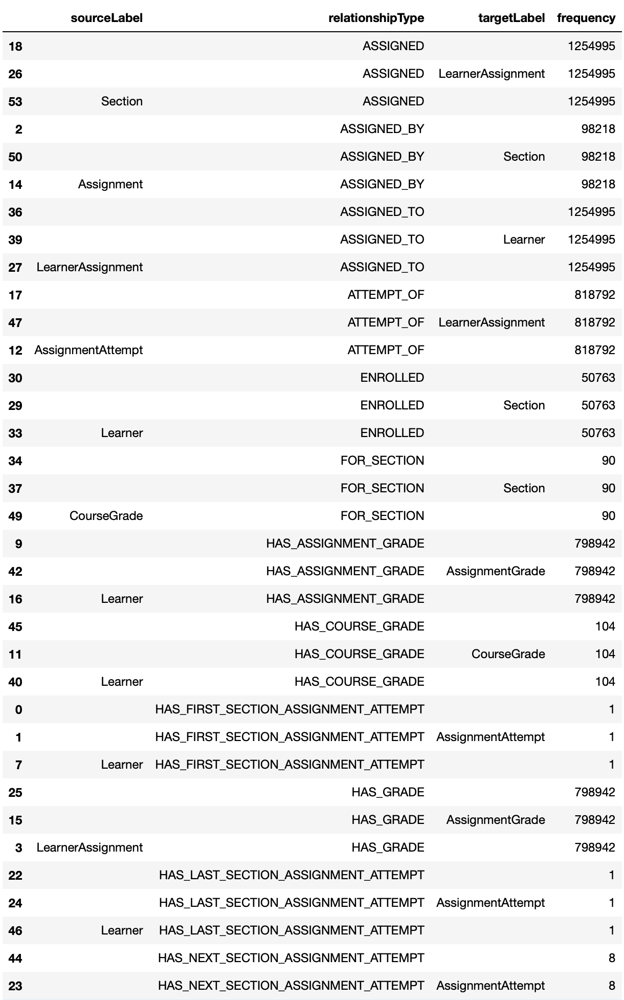
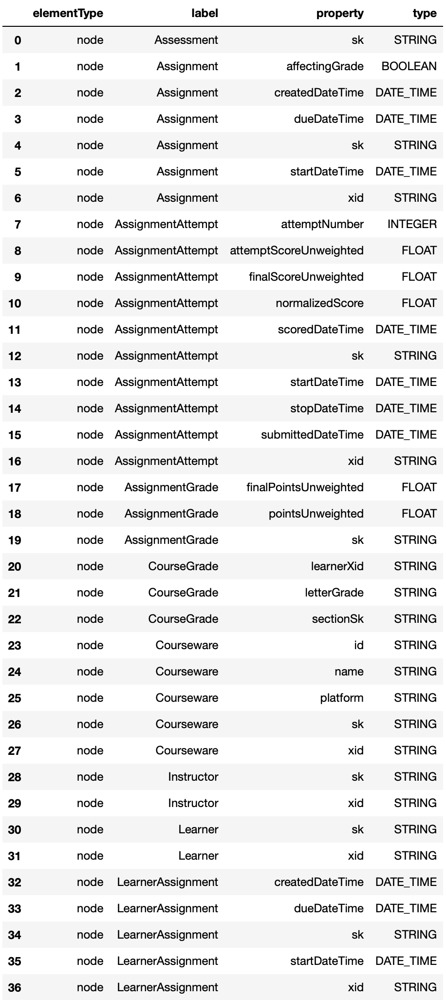
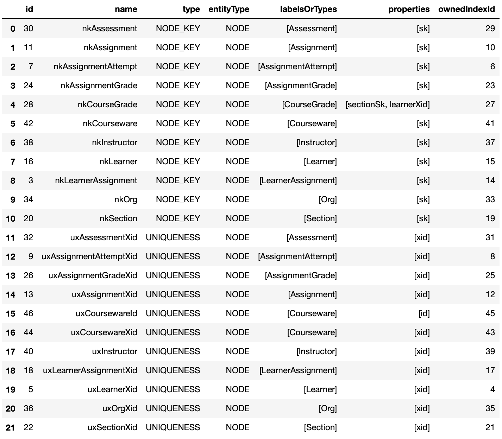
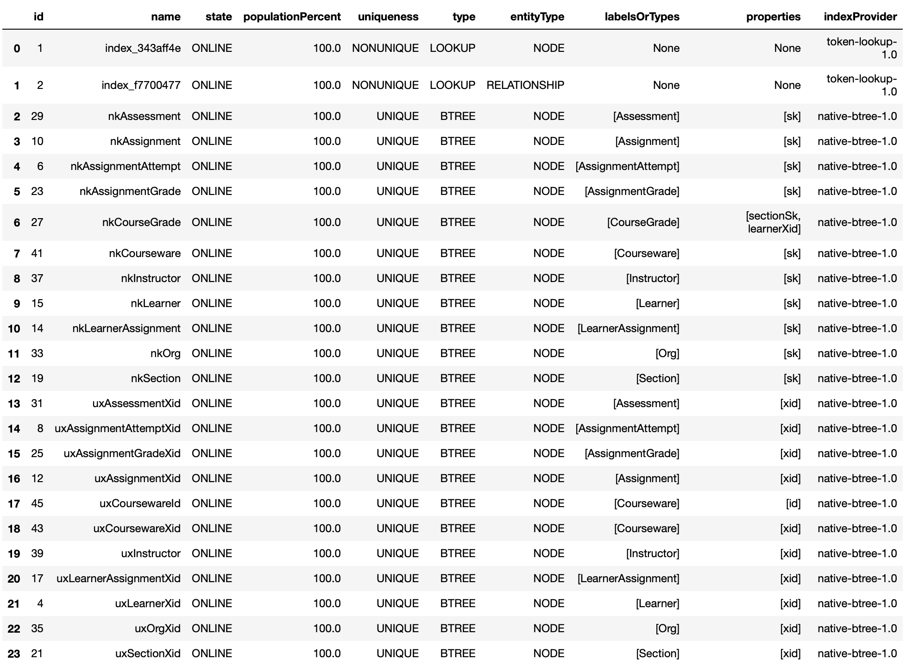
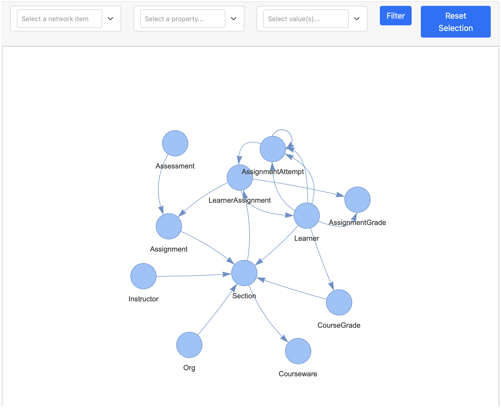
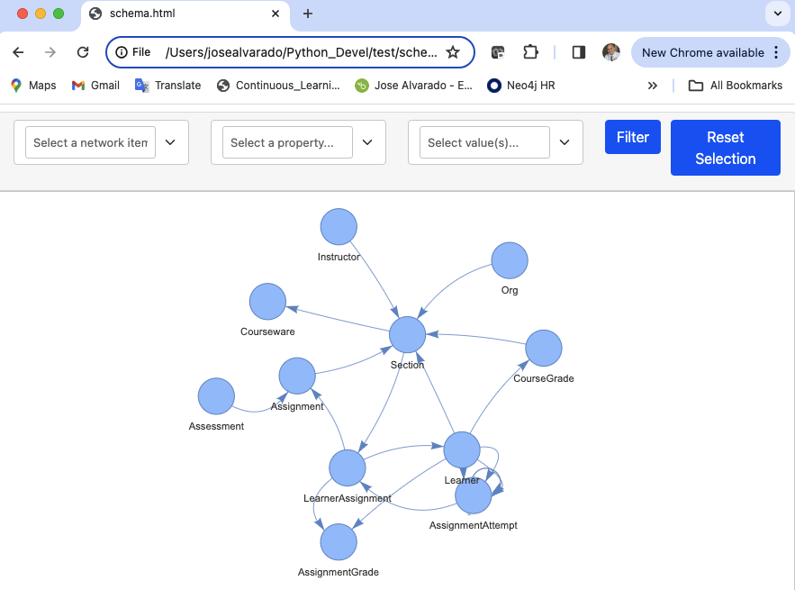

# PyNeoInstance Package

## What is it?

PyNeoInstance is a Python package that provides a user friendly API for submitting Cypher queries to Neo4j and performing Exploratory Data Analysis (EDA) of your graph.

It supports the following features:

- __<u>Read query</u>__: Submit a Cypher read query, with or without parameters, and get a Pandas Data Frame with the results.
- __<u>Write query</u>__: Submit a write Cypher query, with or without parameters, to update an existing database.
- __<u>Write queries</u>__: Submit a list of Cypher queries to update an existing database.
- __<u>Write query with data</u>__: Update a database based on a Pandas Data Frame and a Cypher query.
- __<u>Write queries with data</u>__: Update a database based on a Pandas Data Frame and a list of Cypher queries.
- __<u>Node label frequency</u>__: Get the distribution of the graph node labels.
- __<u>Multi label node frequency</u>__: Get the distribution of the graph multi label nodes.
- __<u>Relationship type frequency</u>__: Get the distribution of the graph relationship types.
- __<u>Relationship type source-target frequency</u>__: Get the distribution of relationship source and target.
- __<u>Node and relationship properties</u>__: Get information of all properties in the graph.
- __<u>Constraints</u>__: Get information of all constraints in the graph.
- __<u>Indexes</u>__: Get information of all indexes in the graph.
- __<u>Schema Visualization</u>__: Visualize the graph schema.


## How to install it?

```python
pip install pyneoinstance
```

## How to use it?

### Instantiating the Neo4jInstance class

In order to use this package, you first need to import the Neo4jInstance class.

```python
from pyneoinstance import Neo4jInstance
```

Once imported, you need to instantiate this class by providing the following arguments:

- _uri_: The Neo4j instance unique resource identifier.
- _user_: The user name used to authenticate. 
- _password_: The user name password.

```python
uri = 'bolt://localhost:7687'
user = 'neo4j'
password = 'password'

graph = Neo4jInstance(uri, user, password)
```

Although the previous code is valid, it is not recommended to hard code your user credentials in your application. As an alternative you can store this information as part of your OS user environment variables and then retrieve them in Python.

```python
import os

uri = os.environ['NEO4J_URI']
user = os.environ['NEO4J_USER']
password = os.environ['NEO4J_PASSWORD']
graph = Neo4jInstance(uri,user,password)
```
Another alternative is to create a YAML configuration file to store this information.

```yaml
# configuration.yaml
db_info:
  uri: neo4j_uri
  user: neo4j_user
  password: user_password
  database: neo4j
```

This YAML file can then be loaded in Python and this information can be retrieve.

```python
from pyneoinstance import load_yaml_file

config = load_yaml_file(configuration.yaml)
db_info = config['db_info']
graph = Neo4jInstance(db_info['uri'], db_info['user'], db_info['password'])
```
### Submitting a Cypher read query

Once you instantiated the Neo4jInstance class, you can submit a Cypher read query by using the class method execute\_read\_query. This method receives the Cypher query string as an argument and optionally the name of the database on which the query should be executed. If the database name is not provided the query will be execute using your default Neo4j database. The results of the query are return as a Pandas Data Frame. To avoid unwanted column names in the resulting Data Frame, always provide aliases for all returned properties.

```python
query = """
    MATCH (m:Movie {title: "The Matrix"})
    RETURN m.tile AS title,
           m.released AS releasedYear,
           m.tagline AS tagline;
"""

data = graph.execute_read_query(query,db_info['database'])
```

### Submitting a Cypher read query with parameters

The method execute\_read\_query can optionally received a Python Dictionary with the parameters required as part of you Cypher query.

```python
query = """
    MATCH (m:Movie {title: $movie_title})
    RETURN m.tile AS title,
           m.released AS releasedYear,
           m.tagline AS tagline;
"""

data = graph.execute_read_query(query, db_info['database'], db_info['database'], parameters={'movie_title':'The Matrix'})
```

### Submitting a Cypher write query

You can submit a Cypher write query using the method execute_write_query. The signature of this method is identical to the execute_read_query. This method returns a dictionary containing the updates made to the database. As with read queries you can also specify a Python dictionary containing Cypher parameters.

```python
query = """
    MERGE(m:Movie {title:$movie_title})
    ON CREATE SET
        m.release = $year,
        m.tagline = $tagline
"""

results = graph.execute_write_query(query, db_info['database'],
  parameters={
    'movie_title':'Wakanda Forever',
    'year'=2022,
    tagline=''Wakanda Forever! Long Live Wakanda! For Honor, For Legacy, For Wakanda!''
  })
```

### Updating a database with data in a DataFrame: Sequentially

We can update a Neo4j database with data contained in a Pandas Data Frame using the methods execute\_write\_query\_with\_data or execute\_write\_queries\_with\_data. These methods return a dictionary containing the numbers and types of updates made to the database. Besides taking the query or list of queries as an argument, we can pass to these methods the following arguments:

- _data_: Pandas Data Frame containing data to process.
- _database_: Optional, database on which to execute the queries.
- _partitions_: Optional, number of partitions use to break the Data Frame in smaller chucks.
- _parallel_: Whether to execute the query using multiple Python process.
- _workers_: The number of processes to spawn to execute the queries in parallel.
- _parameters_: Extra arguments containing optional cypher parameters.

To illustrates how to use these methods lets imagine we have a csv file that looks like this:

```python
# people.csv
personId,name,birthYear,deathYear
23945,Gérard Pirès,1942,
553509,Helen Reddy,1941,
113934,Susan Flannery,1939,
26706,David Rintoul,1948,
237537,Rita Marley,1946,
11502,Harry Davenport,1866,1949
11792,George Dickerson,1933,
7242,Temuera Morrison,1960,
3482,Chus Lampreave,1930,
```

We want to update our database by loading this data as a node with the label Person containing the properties id, name, birthYear and deathYear. To accomplish this, we need to performed the following steps:

1. Load the csv to Python as a Data Frame.
2. Develop the Cypher query that is going to be use to load the Data Frame into Neo4j.
3. Call the execute\_write\_query\_with\_data of an existing instance of the Neo4jInstance class passing the Data Frame, Cypher query and any other optional arguments to this method. 

```python
import pandas as pd

person_data = pd.read_csv('people.csv')

person_load_query = """
  WITH $rows AS rows
  UNWIND rows AS row
  MERGE(p:Person {id:row.personId})
    ON CREATE
      SET p.id = row.personId,
          p.name = row.name,
          p.birthYear=toInteger(row.birthYear),
          p.deathYear = toInteger(row.deathYear)
"""

person_load_result = graph.execute_write_query_with_data(person_load_query, person_data, db_info['database'])
```

It is not a good practice to store your Cypher queries as strings within your Python modules. To solve this, we can extend our YAML configuration file to store all our Cypher queries.

```yaml
# configuration.yaml
db_info:
  uri: neo4j_uri
  user: neo4j_user
  password: user_password
  database: neo4j
loading_queries:
  nodes:
    Person: |
      WITH $rows AS rows
      UNWIND rows AS row
      MERGE(p:Person {id:row.personId})
        ON CREATE
          SET p.id = row.personId,
              p.name = row.name,
              p.birthYear=toInteger(row.birthYear),
              p.deathYear = toInteger(row.deathYear)
```

Now that we added the loading query to our configuration file, lets re-write our Python script to get this query from the configuration file.

```python
import pandas as pd

person_data = pd.read_csv('people.csv')

node_load_queries = config['loading_queries']['nodes']

person_load_result = graph.execute_write_query_with_data(node_load_queries['Person'], person_data, db_info['database'])
```

If the number of rows in your Data Frame is 100K or more it is recommended to break the Data Frame in smaller chunks so that they can be process in different transactions. This will avoid running out of heap error. To do this, just indicate in the _partitions_ argument how many partitions would you like to break this Data Frame into. These partitions will be loaded in different sequential transactions unless you specified loading them in parallel by setting the _parallel_ argument to true. We will discuss this process in the next section.

```python
person_load_result = graph.execute_write_query_with_data(
    node_load_queries['person'],
    person_data,
    db_info['database'],
    partitions = 5
    )
```
## Updating a database with data in a Data Frame: Parallel  

To load the data in the Data Frame in parallel, we need to partition the Data Frame by incrementing the _partitions_ argument and set the _parallel_ argument to true. By default, this will use all the available virtual CPUs in the machine. If you need to use less, you can specify how many to use by setting the _workers_ argument.

```python
person_load_result = graph.execute_write_query_with_data(
    node_load_queries['person'],
    person_data,
    partitions = 5,
    parallel = True,
    workers = 5
    )
```
## Graph EDA

### Node Label Frequency
The get_node_label_freq method provides the frequency and relative frequency of all nodes in the graph. This method consider all node labels as single labels, if you want the distribution considering multiple labels use the get_node_multilabel_freq method.
```python
graph.get_node_label_freq(database='mydbname')
```


### Relationship Type Frequency
The get_rela_type_freq method provides the frequency and relative frequency of all relationship types in the graph.
```python
graph.get_rela_type_freq(database='mydbname')
```


### Relationship Source-Target Frequency
The get_rela_source_target_freq method provides the frequency and relative frequency of all relationship types considering the node label of the source and targets of the relationships.
```python
graph.get_rela_type_freq(database='mydbname')
```


### Properties
The get_properties method provides information about all the nodes and relationships properties.
```python
graph.graph.get_properties(database='mydbname')
```


### Constraints
The get_constraints method provides information about all the graph constraints.
```python
graph.get_constraints(database='mydbname')
```


### Indexes
The get_indexes method provides information about all the graph indexes.
```python
graph.get_indexes(database='mydbname')
```


### Schema Visualization
The graph.get_schema_visualization provides an interactive UI with the visualization of the graph schema with the ability to filter the schema. This UI can be access via a Notebook or HTML page. This visualization display the node labels as string close to nodes, relationship types are only display on mouse hover.

```python
schema = graph.get_schema_visualization(database='mydbname')
schema.show('schema.html')
```


To access the UI via HTTML page just set the parameter notebook to false in the show method.

```python
schema = graph.get_schema_visualization(database='mydbname')
schema.show('schema.html',notebook=False)
```


## More detailed examples

For more detailed examples in loading data and performing graph EDA please read the following articles:
1. [article](https://medium.com/@a-gilmore/pyneoinstance-a-user-friendly-python-library-for-neo5j-dbefa3118bb2)
2. 
